# Hibiscus Example

<p align="center">
  
  <br>
  <em>Hibiscus框架的官方演示项目，展示框架核心功能与基础特性</em>
</p>

<p align="center">
  <a href="#环境要求">环境要求</a> •
  <a href="#快速开始">快速开始</a> •
  <a href="#功能演示">功能演示</a> •
  <a href="#开发指南">开发指南</a> •
  <a href="#常见问题">常见问题</a>
</p>

## ✨ 项目介绍

本项目是 Hibiscus 框架的官方演示项目，旨在帮助开发者快速上手和了解框架的各项功能。通过具体的代码示例和详细的说明文档，使开发者能够轻松地将 Hibiscus 框架整合到自己的项目中。

## 🔧 环境要求

- JDK 8+
- Maven 3.6+
- Redis 5.0+
- MySQL 5.7+

## 🚀 快速开始

### 1. 克隆项目

```bash
git clone https://github.com/heathcetide/hibiscus-example.git
cd hibiscus-example
```

### 2. 配置数据库

修改 `src/main/resources/application.yml`:

```yaml
spring:
  datasource:
    url: jdbc:mysql://localhost:3306/hibiscus_demo
    username: your_username
    password: your_password
  redis:
    host: localhost
    port: 6379
```

### 3. 初始化数据库

```bash
mysql -u your_username -p hibiscus_demo < docs/sql/init.sql
```

### 4. 启动项目

```bash
mvn spring-boot:run
```

## 💡 功能演示

### 核心功能

#### 1. 用户认证
> 访问 http://localhost:8080/api/auth/login
- 默认账号: admin
- 默认密码: admin

<details>
<summary>查看截图</summary>
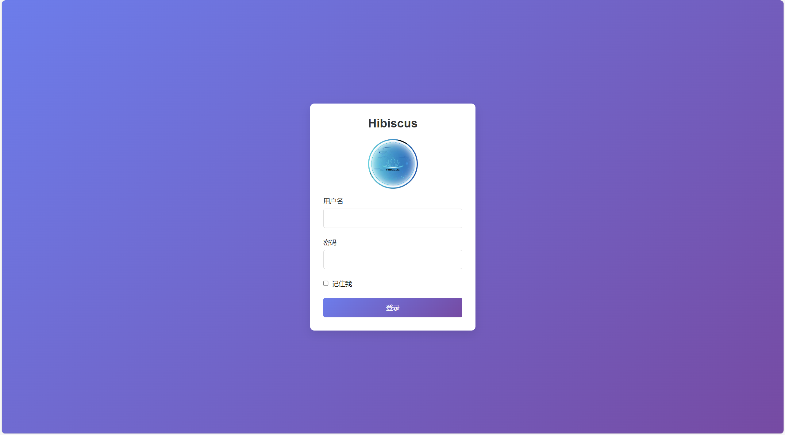
</details>

#### 2. 后台管理系统

##### 代码生成器
- 自动连接数据库
- 一键生成完整代码结构
- 实时代码编辑与保存

<details>
<summary>查看功能截图</summary>
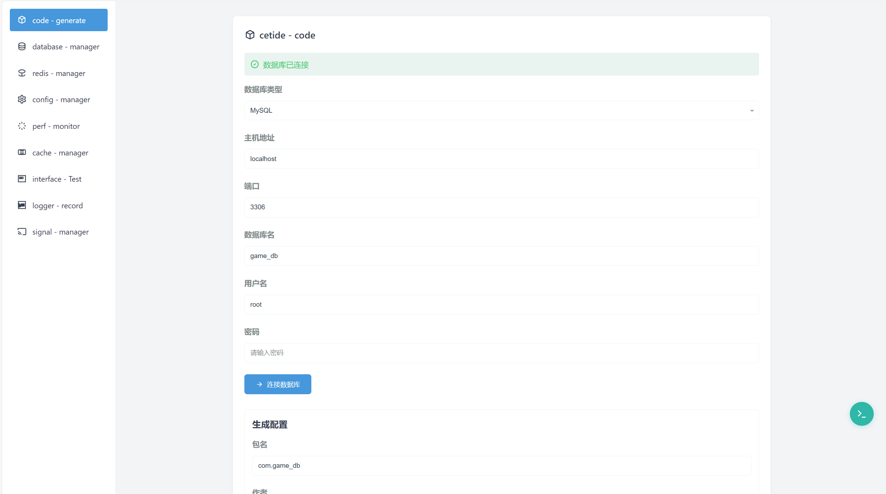
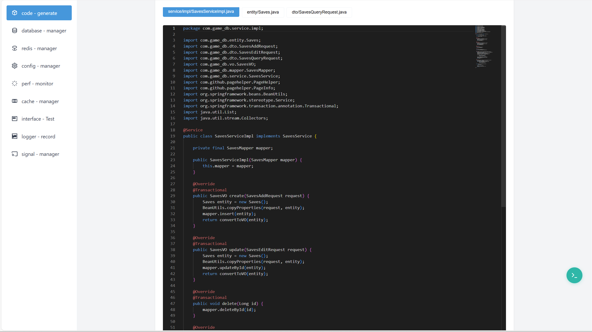
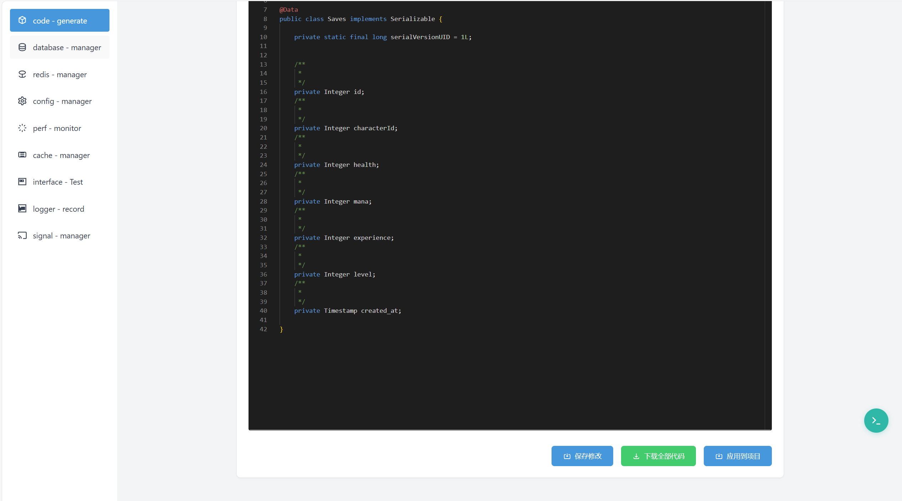
</details>

##### 数据库管理
- 可视化数据操作
- 支持增删改查
- 实时数据同步

<details>
<summary>查看功能截图</summary>
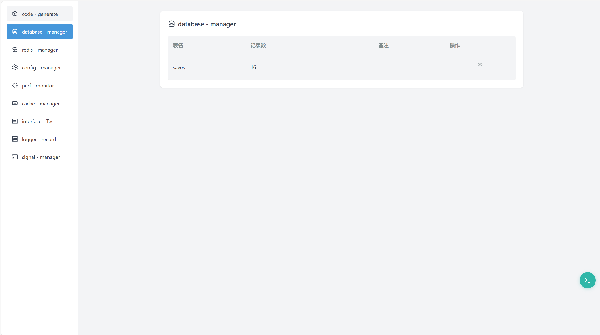

</details>

##### Redis管理
- 自动检测Redis连接
- 支持手动连接配置 
- 数据增删改查操作
- 实时监控与管理

<details>
<summary>查看功能截图</summary>

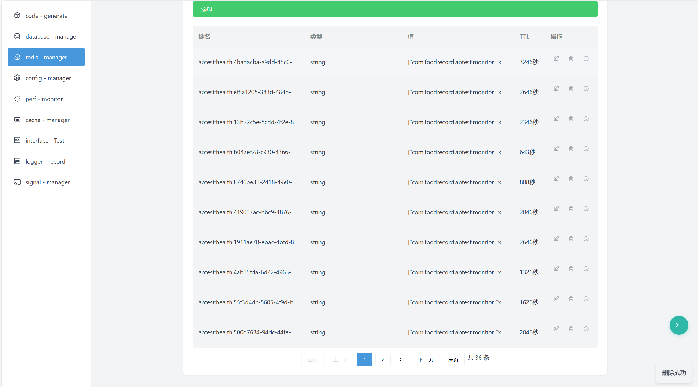
</details>

##### 配置中心
- 支持多种配置文件管理
  - Spring配置文件
  - 语音包配置
  - 日志配置
  - 其他自定义配置
- 在线实时修改
- 配置历史记录
- 配置对比与回滚

<details>
<summary>查看功能截图</summary>
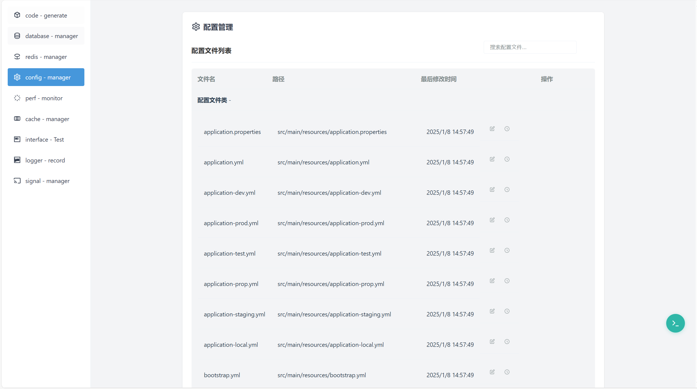
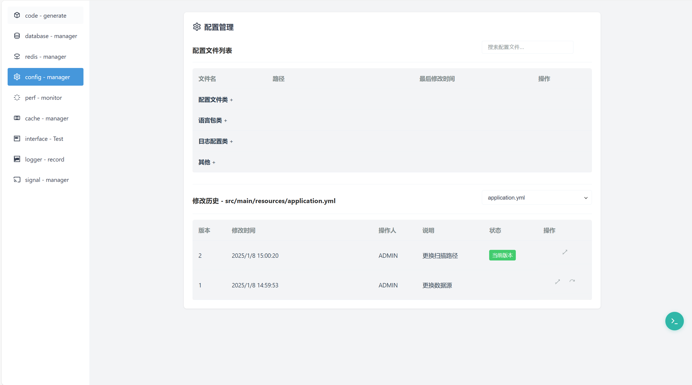
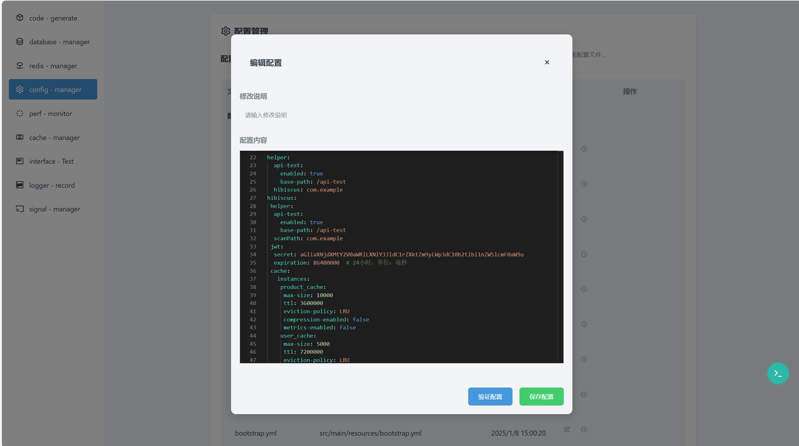
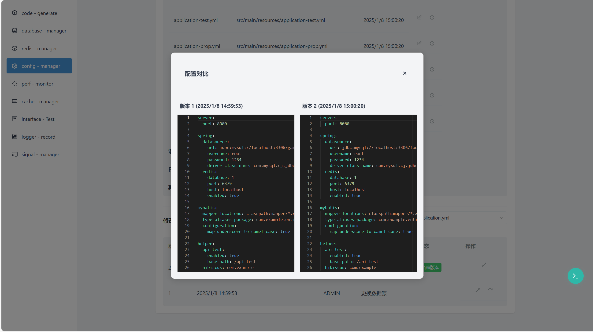
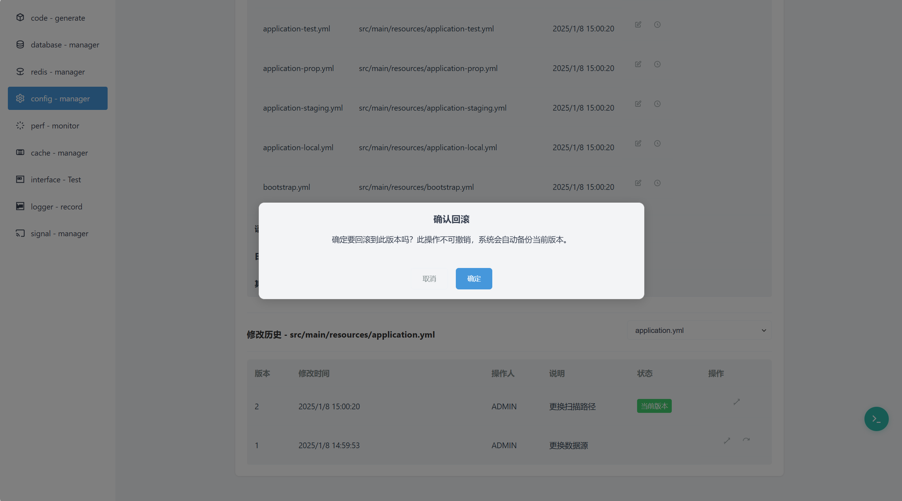
</details>

##### 性能监控
- JVM监控
  - 堆内存使用情况
  - 非堆内存使用情况
  - Young GC次数
  - Full GC次数
- 线程监控
  - 活跃线程数
  - 守护线程数
  - 峰值线程数
- 数据库连接池监控
  - 活跃连接数
  - 空闲连接数
  - 总连接数
  - 最大连接数
- API性能监控
  - 总请求数
  - 平均响应时间
  - 错误率
  - API调用历史
  - API路径统计

<details>
<summary>查看功能截图</summary>
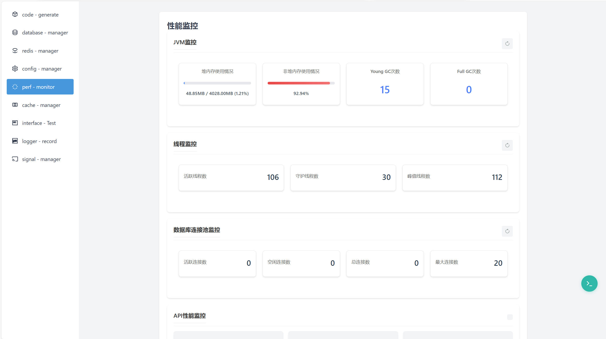
</details>

##### 缓存管理
- HibiscusCache实时监控
- 缓存数据可视化
- 支持增删改查操作
- 动态资源分配
- 性能指标统计

<details>
<summary>查看功能截图</summary>
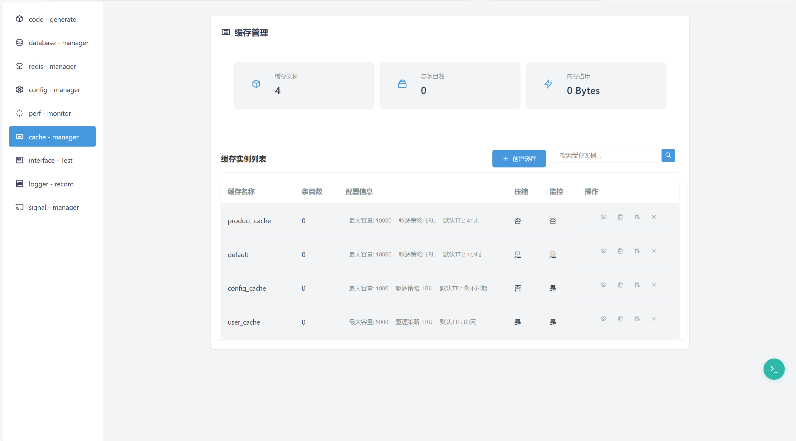
</details>

##### 信号管理
- HibiscusSignal业务解耦
- 实时信号监测
- 动态资源分配
- 性能优化支持

<details>
<summary>查看功能截图</summary>
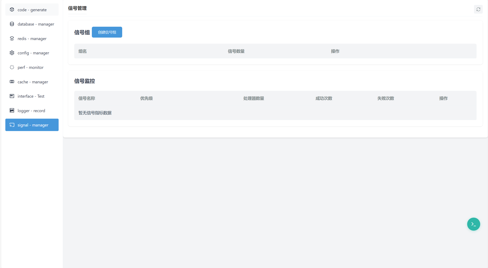
</details>

#### 3. 接口测试工具
> 访问 http://localhost:8080/api/hibiscus/interface

- 接口调试功能
- 性能测试支持
- 接口文档管理
- 支持导出(Markdown/HTML)

<details>
<summary>查看功能截图</summary>
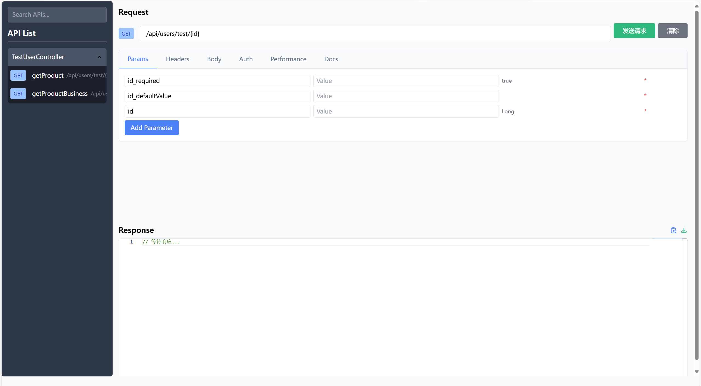
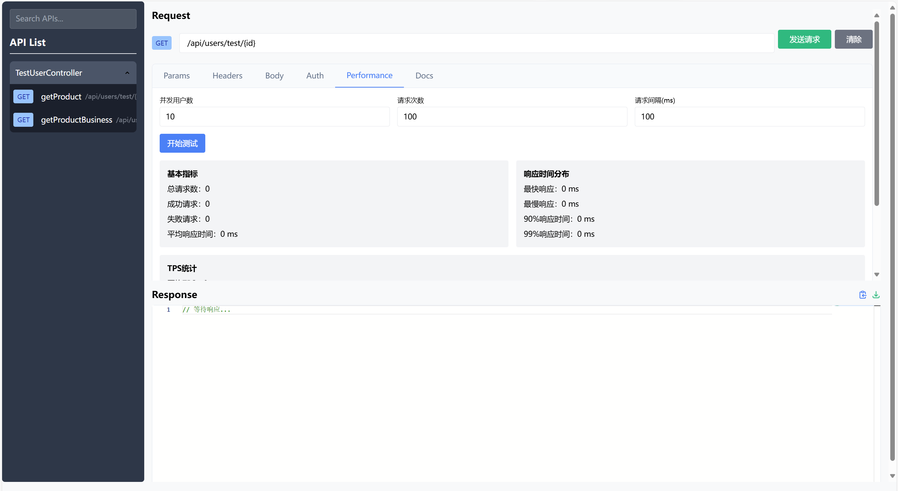
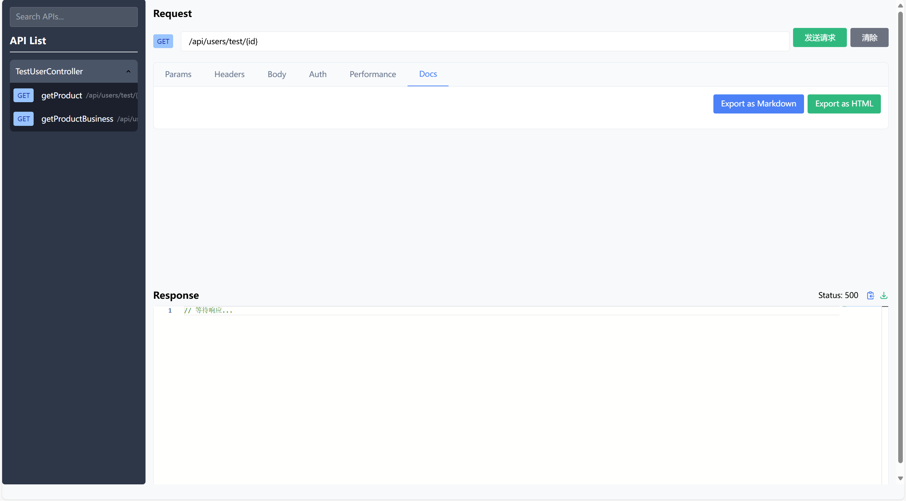
</details>

#### 4. 日志管理
> 访问 http://localhost:8080/api/hibiscus/logs

- 实时日志展示
- 多级别日志过滤
- 日志检索功能
- 快速错误定位

<details>
<summary>查看功能截图</summary>
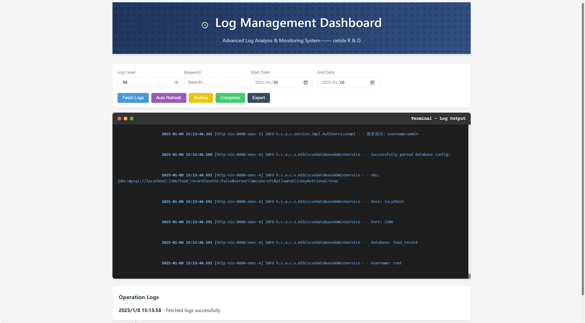
</details>

## 📚 开发指南

### 配置示例

```yaml
server:
  port: 8080
spring:
  datasource:
    url: jdbc:mysql://localhost:3306/food_record
    username: root
    password: 1234
# ... [其他配置]
```


### 示例代码

1. **配置文件示例**

```yaml
server:
   port: 8080
# 数据库和Redis相关配置
spring:
   datasource:
      url: jdbc:mysql://localhost:3306/food_record?useSSL=false&serverTimezone=UTC&allowPublicKeyRetrieval=true
      username: root
      password: 1234
      driver-class-name: com.mysql.cj.jdbc.Driver
   redis:
      database: 1
      port: 6379
      host: localhost
      enabled: true
helper:
   api-test:
      enabled: true
      base-path: /api-test
   hibiscus: com.example
hibiscus:
   helper:
      api-test:
         enabled: true
         base-path: /api-test
      scanPath: com.example
   # jwt相关配置
   jwt:
      secret: aGliaXNjdXMtY2V0aWRlLXNlY3JldC1rZXktZm9yLWp3dC10b2tlbi1nZW5lcmF0aW9u
      expiration: 86400000  # 24小时，单位：毫秒
   # HibiscusCache连接配置[非必须]
   cache:
      instances:
         product_cache:
            max-size: 10000
            ttl: 3600000
            eviction-policy: LRU
            compression-enabled: false
            metrics-enabled: false
         user_cache:
            max-size: 5000
            ttl: 7200000
            eviction-policy: LRU
            compression-enabled: true
            metrics-enabled: true
         config_cache:
            max-size: 1000
            ttl: -1
            eviction-policy: LRU
            compression-enabled: false
            metrics-enabled: true
   # 终端连接配置[非必须]
   ssh:
      connection-timeout: 30000
      channel-timeout: 30000
      strict-host-key-checking: false
      default-terminal-type: xterm
      default-cols: 80
      default-rows: 24
   #设置用户组，开发者可以设置这些用户进行登录后台进行操作，若不设置则默认账号密码为admin   
   auth:
      admins:
         - username: admin
           password: password
         - username: dev
           password: dev123
```

2. **控制器示例**

```java
@GetMapping("/{id}")
@SignalEmitter("user:login")
public String getProductBusiness(@PathVariable Long id) {
   // 使用 BusinessCache 而不是直接使用 HibiscusCache
   BusinessCache<String, String> cache = cacheManager.getBusinessCache("product_cache");
   cache.put("user" + id, "hibiscus - amazing"+id.toString());
   HibiscusSignalContextCollector.collect("user", id);
   String user = cache.get("user" + id);
   return user;
}
```

3. **HibiscusCache使用示例**
```java
//开发者可以自己定义缓存实例，如果不自己定义，可以使用默认存在的default实例
//1.注入HibiscusCacheManager
@Autowired
private HibiscusCacheManager cacheManager;
@GetMapping("/{id}")
public String getProductBusiness(@PathVariable Long id) {
   // 2.使用 BusinessCache直接使用
   BusinessCache<String, String> cache = cacheManager.getBusinessCache("product_cache");
   cache.put("user" + id, "hibiscus - amazing"+id.toString());
   String user = cache.get("user" + id);
   return user;
}
```

4. **HibiscusSignal使用示例**
```java
//开发者可以使用注解进行调用HibiscusSignal,注解中的内容即为信号的名字
@GetMapping("/{id}")
@SignalEmitter("user:login")
public String getProductBusiness(@PathVariable Long id) {
    // 使用 BusinessCache
   BusinessCache<String, String> cache = cacheManager.getBusinessCache("product_cache");
   cache.put("user" + id, "hibiscus - amazing"+id.toString());
   //设置中间值
   HibiscusSignalContextCollector.collect("user", id);
   String user = cache.get("user" + id);
   return user;
}
//定义一个方法使用@SignalHandler来进行操作
//HibiscusSignal默认情况下可以获取到接口方法的返回值，也就是上面的String类型的user，对应了下方参数中的user
//此外HibiscusSignal支持获取中间值，可以使用HibiscusSignalContextCollector.collect("user", id);存放
//context.getIntermediateValue("user");进行获取
@SignalHandler("user:login")
public void handleUserLogin(String user, SignalContext context) {
   Long userId = (Long)context.getIntermediateValue("user");
   System.out.println("receive ---- key "+user+ "    value ---- " + userId);
}
```

## ❓ 常见问题

<details>
<summary>1. 启动失败</summary>

- 检查数据库配置是否正确
- 确保Redis服务已启动
- 检查端口是否被占用
</details>

// ... [其他常见问题]

## 🤝 参与贡献

1. Fork 本仓库
2. 创建新的分支: `git checkout -b feature/your-feature`
3. 提交更改: `git commit -m 'Add some feature'`
4. 推送到分支: `git push origin feature/your-feature`
5. 提交 Pull Request

## 📞 联系我们

- 作者：heath-Cetide
- 邮箱：2148582258@qq.com
- 微信：ct288513832

## 📄 许可证

本项目采用 MIT 许可证 - 详见 [LICENSE](LICENSE) 文件 